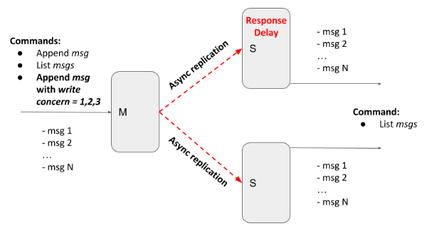

# ITERATION 2

In the [previous iteration](https://github.com/a-kravets/Data-Engineering-UCU/tree/main/Distributed%20Systems/iteration_1), the replication was blocking for all secondaries, i.e. to return a response to the client, we should receive acknowledgements (ACK) from all secondaries.

Current iteration provides tunable semi-synchronicity for replication, by defining write concern parameters. 
* client `POST` request in addition to the message should also contain write concern parameter `w=1,2,3,..,n`
* `w` value specifies how many ACKs the master should receive from secondaries before responding to the client
* `w = 1` - only from master
* `w = 2` - from master and one secondary
* `w = 3` - from master and two secondaries 

It also emulates replicas' inconsistency (and eventual consistency) with the master by introducing an artificial delay on the secondary node. In this case, the master and secondary should temporarily return different messages lists.

It also has messages deduplication function and guarantee of the total ordering of messages based on `id`.

**Folder structure:**

* `master.py`: Python script for Master server
* `secondary.py`: Python script for Secondary servers
* `Dockerfile.master`: dockerfile for Master
* `Dockerfile.secondary`: dockerfile for Secondary
* `docker-compose.yml`: docker-compose to build the container (has secondary and secondary_slow services)

**How it works:**

* Set **SECONDARY_DELAYS** in `docker-compose.yml` for **secondary_slow** service (0 or 10 sec, for example)
* Execute `docker compose up --build` command in terminal
* Master server will be at http://127.0.0.2:5000/, while Secondary servers will have the same IP, but increment ports (for instance, http://127.0.0.2:5001/)
* Once the docker is up Secondary servers will register themselves with Master server so it knows where to send messages
* You may use curl or Postman to test how it works
* Example JSON you may pass to test:
  `{
  "message": "hello1",
  "w": 1,
  "id": 1
}`
* Example curl:

  * `curl -X POST -H "Content-Type: application/json" http://127.0.0.2:5000/ -d '{ "message": "msg1", "w": 1, "id": 1 }'`
  
  * `curl http://127.0.0.2:5000/`
  
  * `curl http://127.0.0.2:5001/`
  
  * `curl http://127.0.0.2:5002/`
