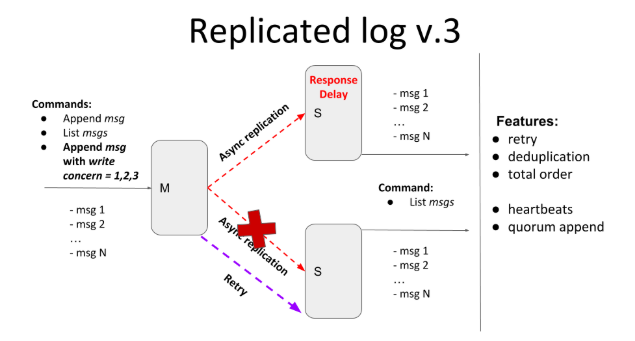

# ITERATION 3

In the [previous iteration](https://github.com/a-kravets/Data-Engineering-UCU/tree/main/Distributed%20Systems/iteration-2), provided tunable semi-synchronicity for replication, by defining write concern parameters.

Current iteration provides tunable semi-synchronicity for replication with a retry mechanism that should deliver all messages exactly-once in total order.
