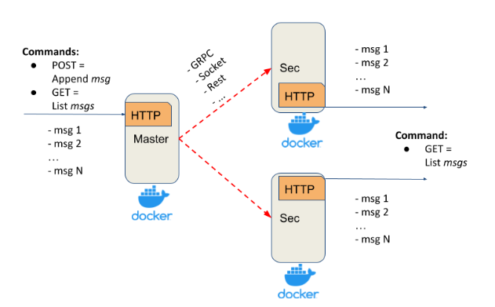

# ITERATION 1

The Replicated Log has the following deployment architecture: one Master and any number of Secondaries.

**Master exposes a simple HTTP server with:**
* POST method: appends a message to the in-memory list
* GET method: returns all messages from the in-memory list

**Secondary exposes a simple  HTTP server with:**
* GET method: returns all replicated messages from the in-memory list
* POST /replicate: automatically registers secondary servers with the Matster so the latter knows where to send a message (POST)

**Properties and assumptions:**
* after each POST request, the message is replicated on every Secondary server
* Master ensures that Secondaries have received a message via ACK
* Master’s POST request is finished only after receiving ACKs from all Secondaries (blocking replication approach)
* to test that the replication is blocking, a delay/sleep is introduced on the Secondary (**SECONDARY_DELAYS** parameter in `docker-compose.yml`)
* at this stage, assume that the communication channel is a perfect link (no failures and messages lost)
* it supports logging
* Master and Secondaries run in Docker

**Folder structure:**

* `master.py`: Python script for Master server
* `secondary.py`: Python script for Secondary servers
* `Dockerfile.master`: dockerfile for Master
* `Dockerfile.secondary`: dockerfile for Secondary
* `docker-compose.yml`: docker-compose to build the container (has secondary and secondary_slow services)

**How it works:**

* Set **SECONDARY_DELAYS** in `docker-compose.yml` for **secondary_slow** service (0 or 10 sec, for example)
* Execute `docker compose up --build` command in terminal
* Master server will be at http://127.0.0.2:5000/, while Secondary servers will have the same IP, but increment ports (for instance, http://127.0.0.2:5001/)
* Once the docker is up Secondary servers will register themselves with Master server so it knows where to send messages
* You may use curl or Postman to test how it works
